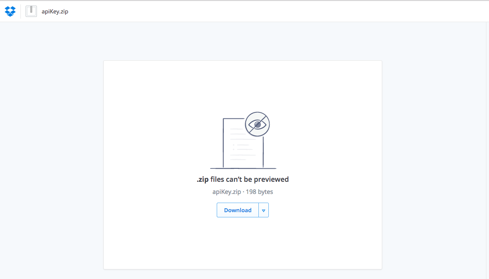
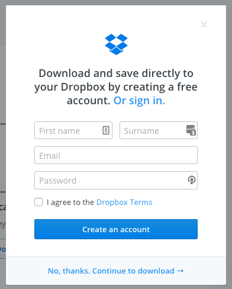
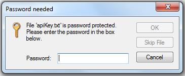
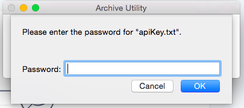

# Digital Humanities Library Lab: Exploring digital collections, 3 March 2017
## Get the API Key for Adam Matthew

### Basic instructions
- Use the Bitly link that will be distributed in the classroom.
- It will take you to a DropBox page.
- If you are given a link to a text file, follow method A.
- If you are given a link to a zip file, follow method B.
- Copy the 32-digit API key for use in the workshop.

### Method A: text file
- After you follow the link, you can view the API Key in the browser.

### Method B: zip file
- After you follow the link, you can access the zip file from DropBox. There is no preview.

- Download the file from the __Download__ button. 
- You do not need to create an account! If requesting, choose __No thanks. Continue to download__

- After the file has downloaded, double-click to open it. 
- You will be asked for a password, at this stage or when opening the text file within. This password will be given in the workshop.
 Windows
 Mac
- After that, you can open the text file containing the API key.

[:arrow_up_small: Back to top](#basic-instructions) | [:arrow_double_up: Parent](ammo.html)

[:house: Home](/)