# Digital Humanities Library Lab: Exploring digital collections, 3 March 2017


## Activity: Adam Matthew Mass Observation
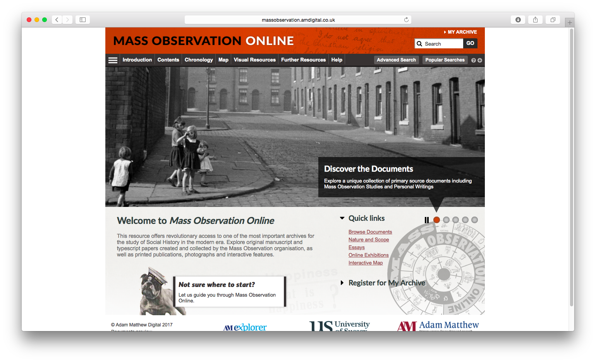
### What is it? How can I use it?
[Mass Observation Online](http://www.massobservation.amdigital.co.uk/){:target="_blank"} is a online collection from Adam Matthew Digital. The University of Manchester subscribes to this resource which includes original manuscript and typescript papers created and collected by the Mass Observation organisation, as well as printed publications, photographs and interactive features. It is known, in part, for its collection of personal diaries from 1935 to 1967, which can be explored via a typical search page or an interactive map of the British Isles.
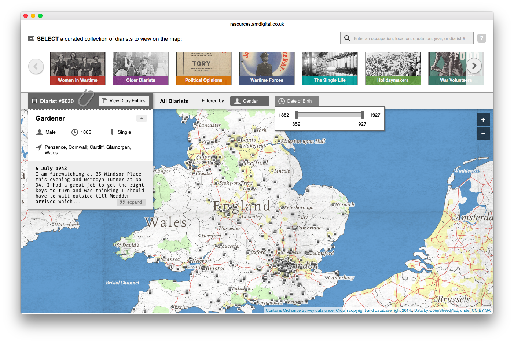

#### Objectives
This resource has been selected for this afternoon's workshop because of its potential for data mining, and we will have a very introductory look at how and why you might use its alternative API interface to the regular web interface. In order to do this, we must cover a bit of technical detail first.

### Overview

- What is an API interface, and how do I use it?
- Get the API key
- Practice in the browser
- Use a simple tool
- Exercise
- Support from Adam Matthew

### What is an API interface, and how do I use it?
Before we address that question, let's understand what happens with a regular web interface.

A typical web request (or visit to a web page) involves a [URL](https://techterms.com/definition/url){:target="_blank"} typed in the address bar of your web browser. It points to a specific site, and a specific page within that site - click in the address bar now to see the URL of this page. 
~~~
Dummy format for a site (root) URL:
http://baseurl.co.uk/

Dummy format for a site page URL:
http://baseurl.co.uk/page.html
~~~
For example, `http://www.massobservation.amdigital.co.uk/`
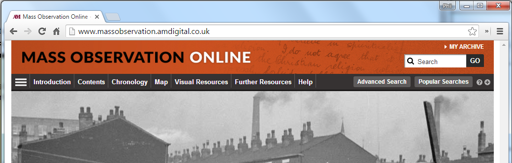

After you enter the URL, either by typing it or clicking on a link that contains it, you will be taken to a web page. For example, click on __Contents__ in the menu to move to the next page which has the URL `http://www.massobservation.amdigital.co.uk/Documents/Landing`
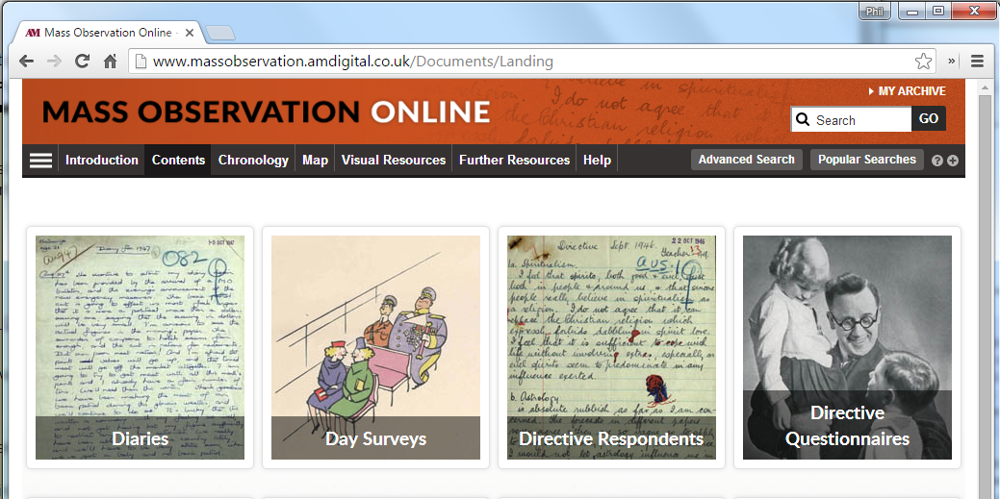

Really, this web page is an HTML document delivered from a web server to your browser; that is, a text file written with HTML tags to give structure is rendered onto the screen. The HTML might look a bit like this.
```html
<html>
	<body>
		<h1>Mass Observation Online</h1>
		<p>This HTML code is <em>very</em> much simplified!</p>
		...
	</body>
</html>
```

#### When pages return structured data
Using the Adam Matthew API is similar. A request takes the form of a URL, which points to a specific bit of data from the Adam Matthew server. You can type or paste Adam Matthew request URLs into your web browser's address bar to return data. The details of the search follow the question mark '?', and each feature of the search is separated by an ampersand '&'.
~~~
Dummy format for a search "apples":
http://baseurl.co.uk/page.html?query=apples

Dummy format for a search "apples", return first 25 results:
http://baseurl.co.uk/page.html?query=apples&take=25
~~~
The data it returns is still text data, but instead of using HTML markup it uses [JSON](https://en.wikipedia.org/wiki/JSON#Example){:target="_blank"} markup. JSON (pronounced "JAY-son") data is structured as dictionary `key:value` pairs, that is, some label or key is assigned some value. If there is more than one pair, they are separated by commas. The value part can itself be a list of `key:value` pairs. For example:
```javascript
{
	timestamp: "2/26/2017 8:10:10 PM",
	totalResults: "25",
	data: [
		{
			type: "apple",
			id: "101",
			variety: "Granny Smith"
		},
		{
			type: "apple",
			id: "102",
			variety: "Pink Lady"
		},
		...
	]
}
``` 

Looking at JSON data in the web browser is not particularly helpful. It is designed for programming languages to interpret, making effective use of the nested key-value pairs structure. JSON data will look better in some browsers, at least make it readable. 

If you got JSON data back from a URL while using Internet Explorer, you will be offered to save the response as a file. This is not very helpful for us, better to use another browser that can show the responses directly.
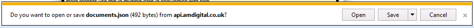

If you use Safari, Firefox or Chrome, you will see the JSON data in the browser, but as one long line with no colour or formatting. This is not very readable by people, although fine for computers.
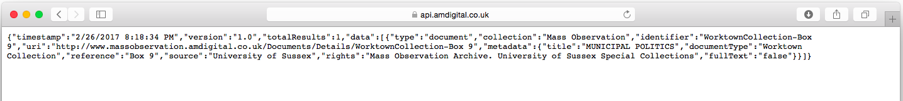

:bulb:  There is a way to make JSON data appear formatted with clear spacing and colouring.  To do this, you may need to __install a browser add-on or extension__.
- Chrome extension: [JSON Viewer](https://chrome.google.com/webstore/detail/json-viewer/gbmdgpbipfallnflgajpaliibnhdgobh?){:target="_blank"}
- Firefox add-on: [JSONView](https://addons.mozilla.org/en-us/firefox/addon/jsonview/){:target="_blank"}
- Alternatively, copy and paste the plain text JSON data into the [Online JSON Viewer](http://jsonviewer.stack.hu/){:target="_blank"} website.

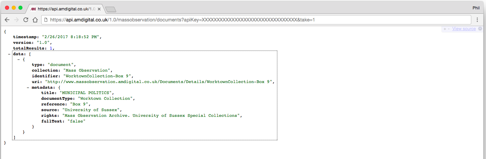
Much better! We can now see the structure.

### Get the API key
For the purposes of security, the URLs that you use to access the Adam Matthew API need to include a 32-digit key. The key given to us for the purpose of this workshop is not included in this web page as it could be viewed by anyone. Please await instructions on the afternoon! :key:
- See [Getting the Adam Matthew API Key](am-key.html) 

The links below have a dummy key XXXXXXXXXXXXXXXXXXXXXXXXXXXXXXXXXX which you can replace with the real one. Also, the service can be used from any computer on University campus (i.e. we are restricted by IP range).

### Practice in the browser
Before we dive into any tools or code, let's try a simple, single request.
1. Copy the example URL request below (one line)
2. Paste into the address bar of a new browser window or tab.
3. __Replace the API key!__ (Copy and paste.)
4. Press Enter. 

~~~
https://api.amdigital.co.uk/1.0/massobservation/documents?apiKey=XXXXXXXXXXXXXXXXXXXXXXXXXXXXXXX&take=1
~~~

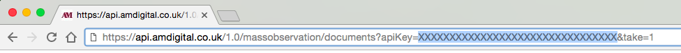
You should see a JSON data response. Don't be put off, it's more useful and meaningful than it first appears.


:bulb: Remember, you may need to install a JSON viewer extension to display the code in a better way.


### Use a simple tool
I have written a webpage you may use to [build an Adam Matthew API URL](https://PhilReedData.github.io/dhll201703/am-url-builder.html){:target="_blank"}, call the API, and see returned JSON data. 
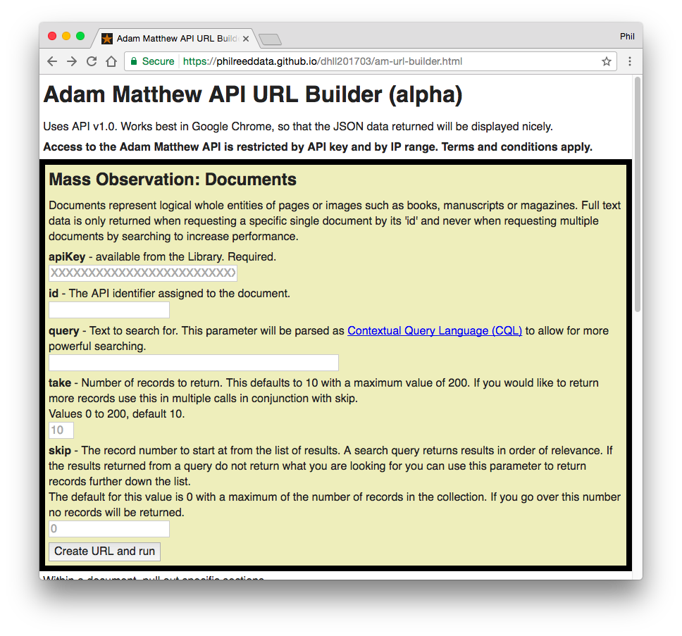

Use this page to search documents by these fields:

- __query__ - the text to search for, parsed as [Contextual Query Language (CQL)](http://developers.amdigital.co.uk/API/CQL){:target="_blank"}
- __take__ - number of records to return, up to 200 (optional)
- __skip__ - the record number to start at from the list of results (optional)

...or, if you know the id of a specific document:

- __id__ - to return a specific document and its full text

Complete some of the fields above, and paste in the API key, and press the __"Create URL and run"__ button.

#### Results

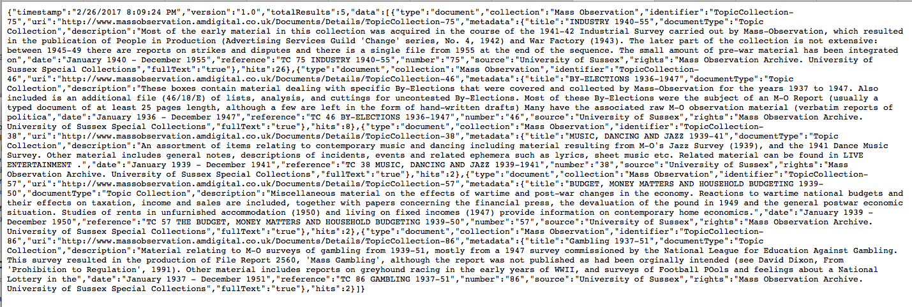
:bulb: Remember, you may need to install a JSON viewer extension to display the code in a better way.
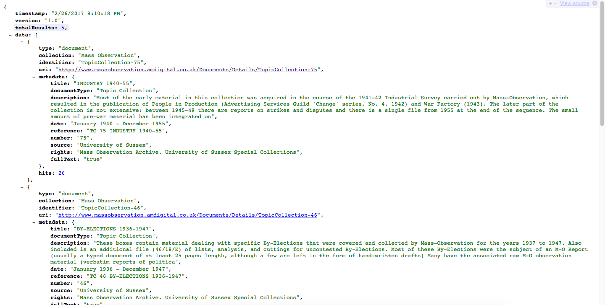

The returned JSON data has a structure which includes:

- __timestamp__ - when the query was executed
- __version__ -  the version of the API used
- __totalResults__ - how many results follow
- __data__ - a list of results, or just one if you specified an "id" in the previous page.

The __data__ items include:

- __type__ - one of "document", "section" or others, depending on the query
- __collection__ - always "Mass Observation" for our queries
- __identifier__ - we can use this in a subsequent query in the "id" field
- __uri__ - a link to view the document in the regular Adam Matthew web interface
- __metadata__ - a list of metadata items such as title, date, source, rights, and fullText (true/false)
- __fullText__ - for a single search result (by id), if available, get the full text (could be slow)

If you request a specific item by its identifier, you may get the full text:
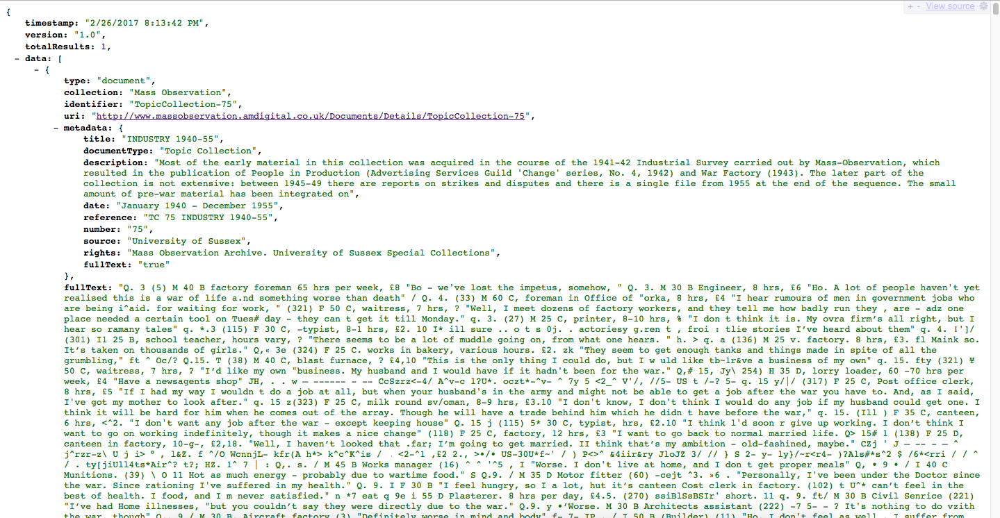


### Exercise
1. Try using the [build an Adam Matthew API URL webpage](https://PhilReedData.github.io/dhll201703/am-url-builder.html){:target="_blank"} to run a query. Consider using CQL syntax such as "prox".
2. Select a result you want to know more about. 
3. View your chosen in the regular Adam Matthew web interface (hint, find the __uri__ field).
4. Can you get to the full text for that document?
5. _Going further_: Try the second form to look at sections within documents. What differences do you see?
6. _Going even further_: Write a short Python script that takes a URL, calls the Adam Matthew API, returns JSON data, then does something with that data. [I have written the start of the script for you...](https://github.com/PhilReedData/AdamMatthewTry)


### Support from Adam Matthew
This is not part of the usual service from Adam Matthew, or from academic libraries in the UK. There is, however, some guidance from [The Adam Matthew API](http://developers.amdigital.co.uk/API/Overview).


[:arrow_up_small: Back to top](#activity-adam-matthew-mass-observation) | [:arrow_double_up: Parent](index.html) | [:arrow_backward: Prev](jstortg.html) | [:arrow_forward: Next](wrapping.html)

[:house: Home](/)
