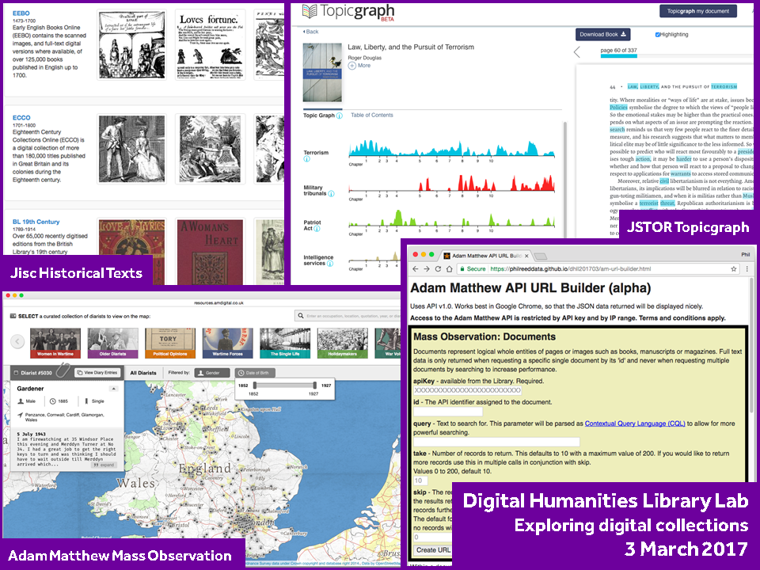

# Digital Humanities Library Lab: Exploring digital collections, 3 March 2017

[Twitter hashtag #dhliblab](https://twitter.com/search?f=tweets&q=%23dhliblab){:target="_blank"}

This workshop is designed to help Faculty of Humanities researchers develop new and exciting computational projects working with the University Library's digital collections. 

[DH@Manchester](http://www.digital-humanities.manchester.ac.uk/) is seeking targeted expressions of interest from Faculty of Humanities researchers at all levels to develop new and innovative computational research projects with partners including [the University of Manchester Library](http://www.library.manchester.ac.uk/) and the [School of Computer Science](http://www.cs.manchester.ac.uk/). In anticipation of the formal Call which will go out shortly, this Library Lab will allow researchers at all levels to gain hands-on experience with tools and techniques in order to go on to develop individual research projects with the collections. 

During the afternoon workshop, you will look at digital text collections from publishers on platforms such as JSTOR, Jisc, Adam Matthew and Gale Cengage, using light-touch text and data mining techniques. Some of the activities will involve using a bit of Python code; however, the workshop assumes you may have no prior programming experience.  Computers will be available for all participants, but you may prefer to bring your own laptop.

For further information and any queries, please contact Phil Reed: [Phil.Reed@manchester.ac.uk](mailto:Phil.Reed@manchester.ac.uk) or [dh@manchester.ac.uk](mailto:dh@manchester.ac.uk).

This event is open to all Faculty of Humanities researchers, but numbers are limited, so please [register as soon as possible via the Eventbrite page](https://www.eventbrite.co.uk/e/digital-humanities-library-lab-exploring-digital-collections-friday-3rd-march-2017-tickets-32115761106). The event is scheduled for 2pm to 5pm on Friday, 3 March 2017 (breaking around 3.30pm for coffee).

Please note that the formal Call for expressions of interest in new project ideas will go out to the Faculty following this workshop. Attendance at the workshop is not a prerequisite for applying to the Call.  

## Overview of the workshop
- [Welcome and introduction](welcome.html)
- [Activity: Jisc Historical Collections](jischc.html)
- [Activity: JSTOR Topicgraph](jstortg.html)
- [Activity: Adam Matthew Mass Observation](ammo.html)
- [Wrapping up](wrapping.html)

[:thumbsup: Finished? Please leave some feedback](https://goo.gl/forms/KmYw8TnrlVt0lw5i1)

### Thanks
I would like to thank the lab assistants on the day: Carlene Barton and Rachel Kirkwood. I would like to give special thanks to the researchers who helped me to refine the workshop plan: Lauren Fonteyn, Andrea Nini and George Walkden.

[:arrow_up_small: Back to top](#digital-humanities-library-lab-exploring-digital-collections-3-march-2017) | [:house: Home](/) | [:arrow_forward: Start](welcome.html)
