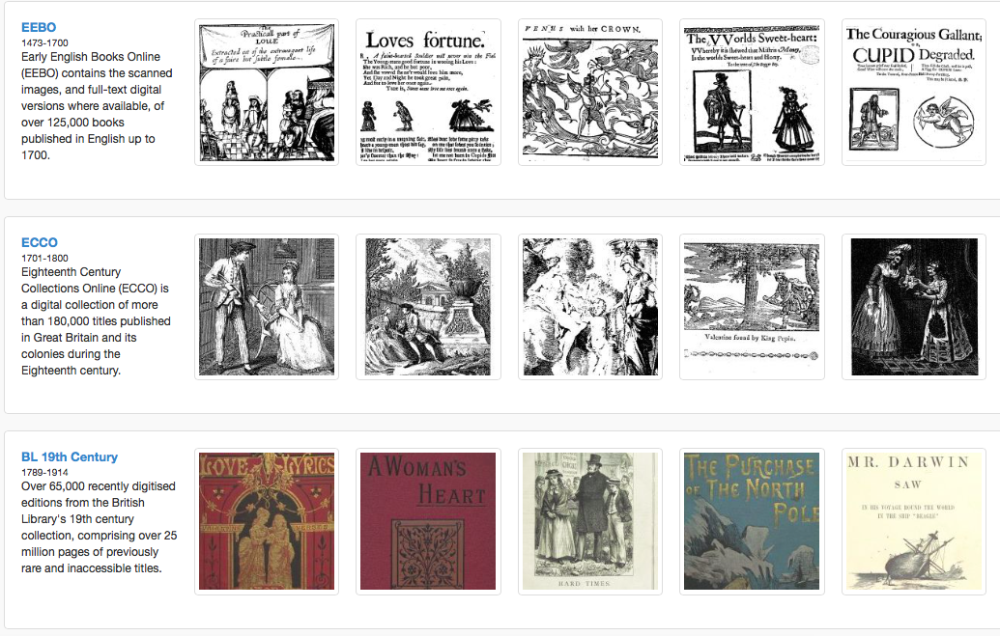
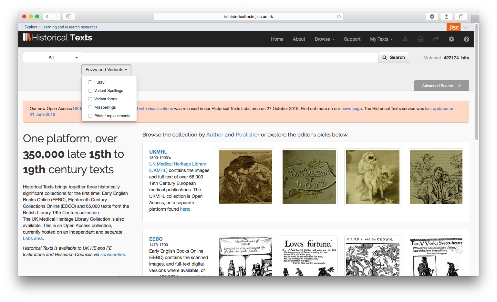
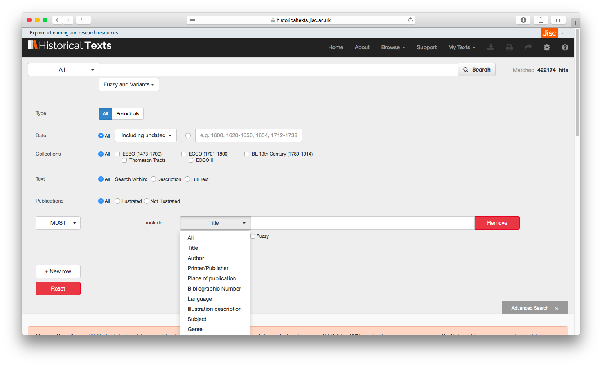
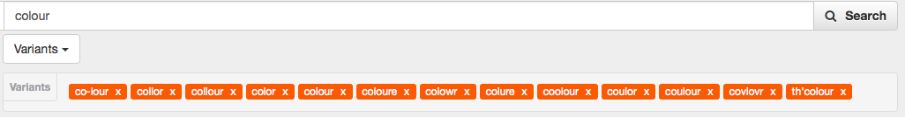
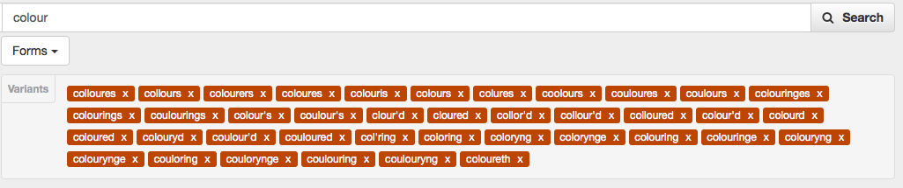
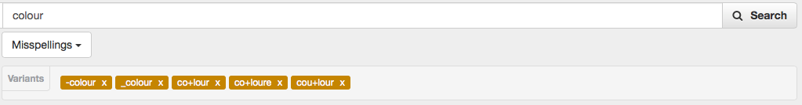
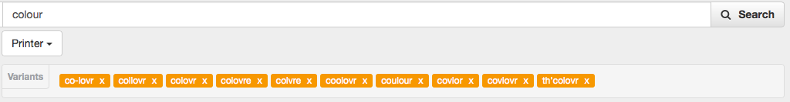
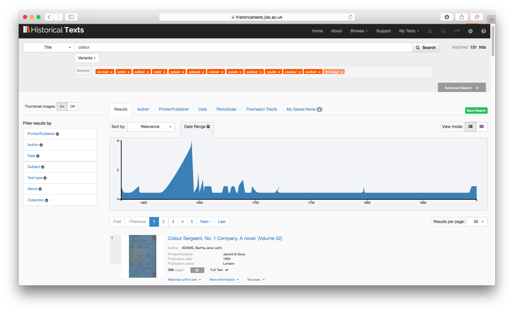
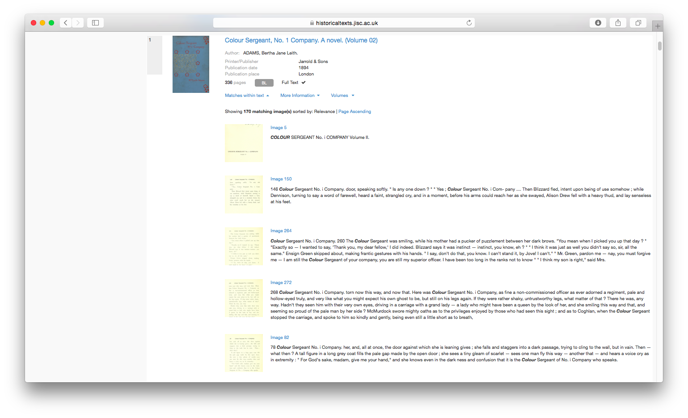
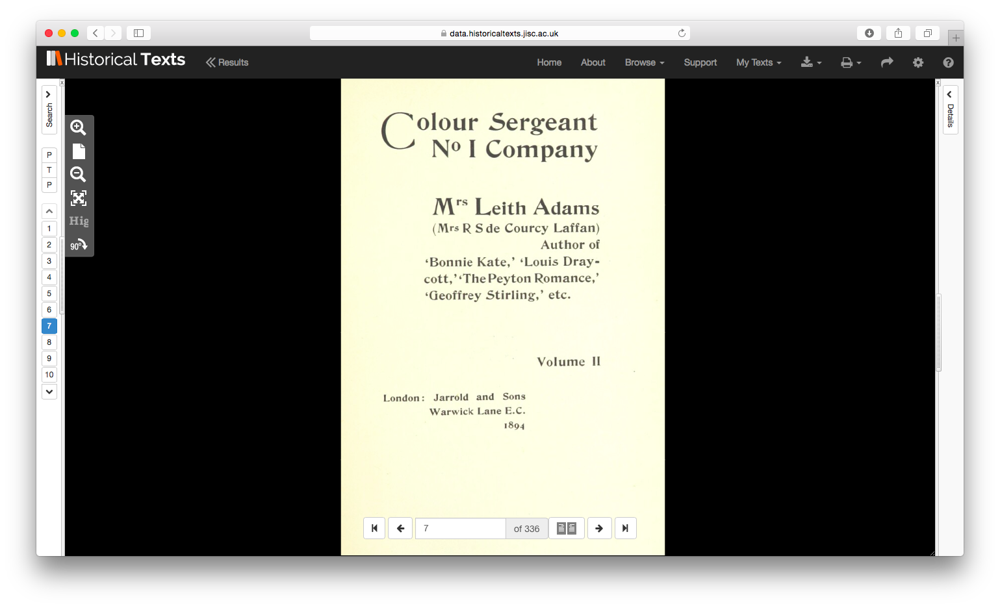

# Digital Humanities Library Lab: Exploring digital collections, 3 March 2017

## Activity: Jisc Historical Collections
We will have a look at [Jisc Historical Collections](http://historicaltexts.jisc.ac.uk/){:target="_blank"}. This interface  provides a single search interface to multiple collections:

- Early English Books Online (EEBO) 1473-1700
- Eighteenth Century Collections Online (ECCO) 1701-1800
- British Library's 19th century collection 1789-1914

_Objective_: We will use Jisc Historical Collections to learn about searching multiple digital text collections for particular words allowing for variations in spelling, typing and printing.

### Fuzzy matching, variant spellings and more

You can use [Jisc Historical Collections](http://historicaltexts.jisc.ac.uk/){:target="_blank"} from anywhere on University campus, or off-campus via your University username and password (Shibboleth).

If you click on the __Advanced search__ button, you will see extra search fields including publication date, choice of collections, and which part of the text to look at (title, author, etc.). 

Below the search text field is a drop-down menu labelled __Fuzzy and Variants__. If you type a word such as "colour" in the search text field, you can choose from the options below to include spelling and typing equivalent words for matching. This can also help if the text you are looking at is not perfectly transcribed by the OCR tools (which is quite likely).

#### Variant spellings
These may be historical alternative spelling variants for the word.

#### Variant forms

#### Misspellings
Common misspellings are suggested.

#### Printer variations
Sometimes one or more characters are substituted in type, for example "w" (one "doubleyoo") may be encoded as "vv" (two "vees").

#### Fuzzy matching
Allows for matching any words within a set spelling distance (no suggestions).

Each of these suggested variants can be disabled by clicking on its "X" button.

### Search results
After clicking the :mag:__Search__ button, the results list is shown, preceded by a chart of matches against publication year. You can select a date range from the chart to further limit the search (simply drag the mouse over the years you want), and you can further refine using the filters on the left.

Matches within text...

Show whole text...

You may download as a PDF, and the full text may be searchable using the usual Ctrl/Cmd+F function.

### Activities
1. Try another word that you expect there may be spelling or typing variants for. Are the suggestions what you would expect?
2. Try a search for something like the following. Do the variants help you to find more relevant results, and quicker?
- Title: contains "illumination" with variant spellings, variant forms, misspellings and printer replacements
- Date: 1701-1900
- Place of publication: London
	

[:arrow_up_small: Back to top](#activity-jisc-historical-collections) | [:arrow_double_up: Parent](index.html) | [:arrow_backward: Prev](welcome.html) | [:arrow_forward: Next](jstortg.html)

[:house: Home](/) 