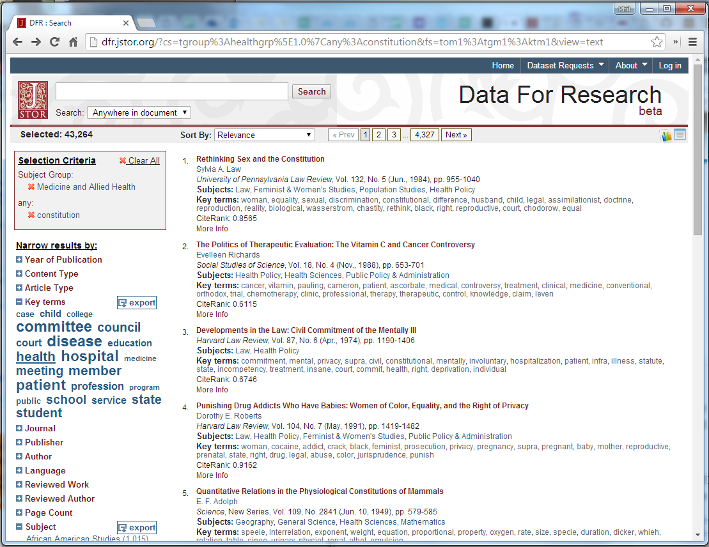
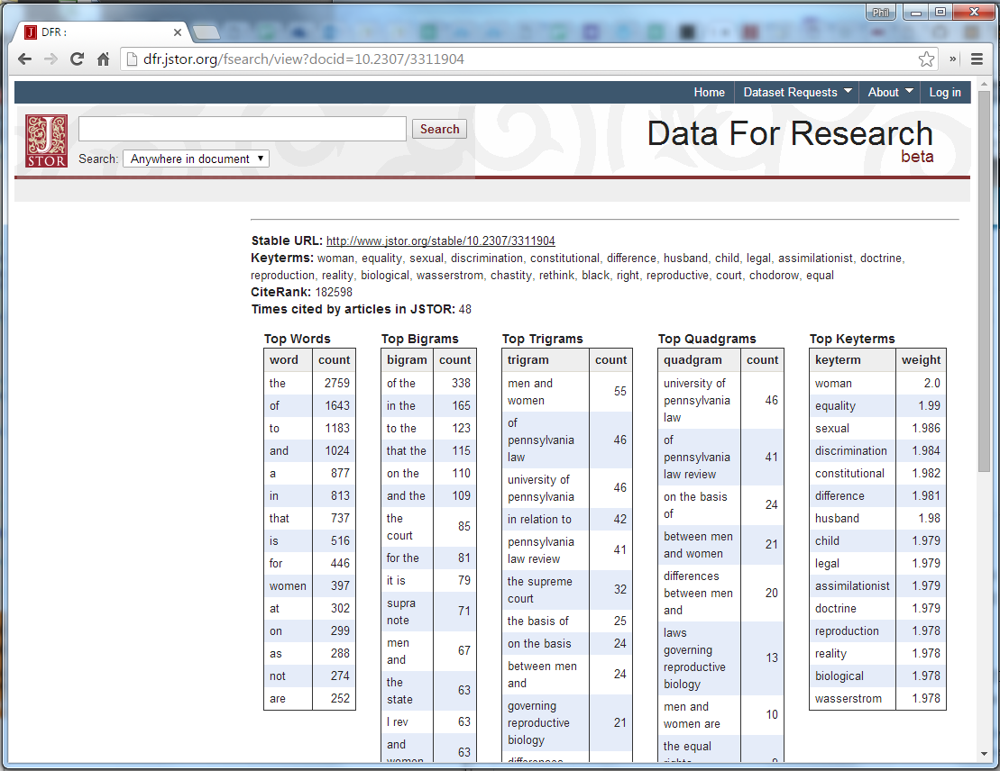
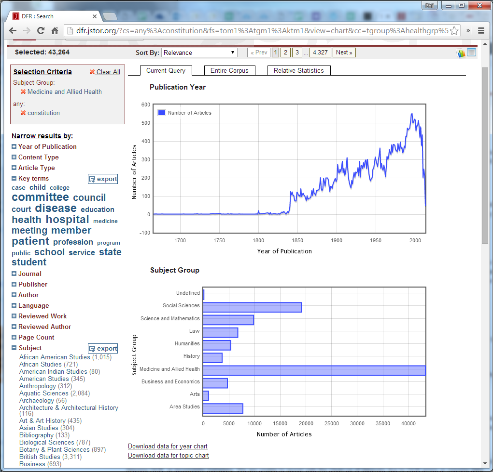

# Digital Humanities Library Lab: Exploring digital collections, 3 March 2017

## Honourable mention: JSTOR Data for Research
If you wish to try these kinds of techniques on another resource, consider [JSTOR Data for Research](http://dfr.jstor.org/){:target="_blank"} (DfR). 

JSTOR DfR allows you to search the same collections as the regular JSTOR web interface (OCR and metadata), but also offers features of interest to Digital Humanists such as:

- Lists of key terms and word frequency counts for each text returned in your search.
- Lists of bi-grams, tri-grams and quad-grams for each text.
- The ability to download these in bulk, as CSV or XML format.
- Interactive charts of publication year or subject group.

You can create a data set of key terms , word counts and N-grams for up to 1,000 texts for no charge. You can explore the results using Excel or text file editors (if you choose the CSV format), but you will need to write a bit of code to make better use of it.

#### Installing Python
How to install Python on the "Managed Desktop" at The University of Manchester:

- Click Start, "Application Catalog".
- In the search bar, type "Python", choose "Anaconda Python 1.9"
- Click "Install" and wait.

[:arrow_up_small: Back to top](#honourable-mention-jstor-data-for-research) | [:arrow_double_up: Parent](wrapping.html) 

[:house: Home](/)
