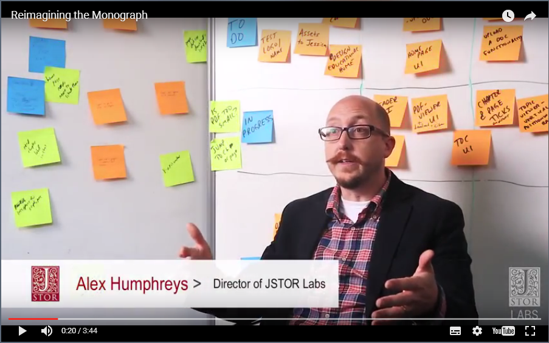
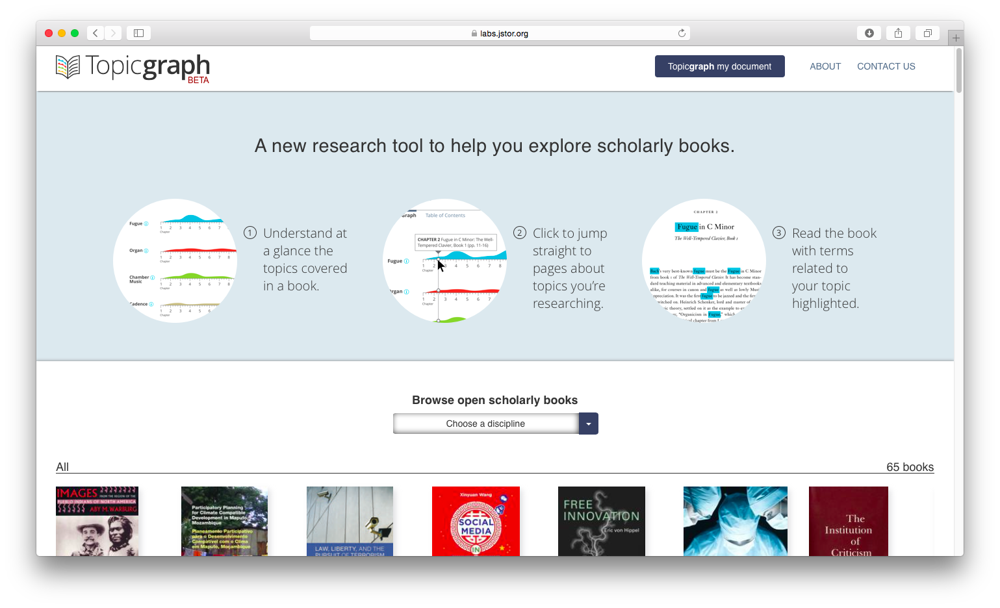
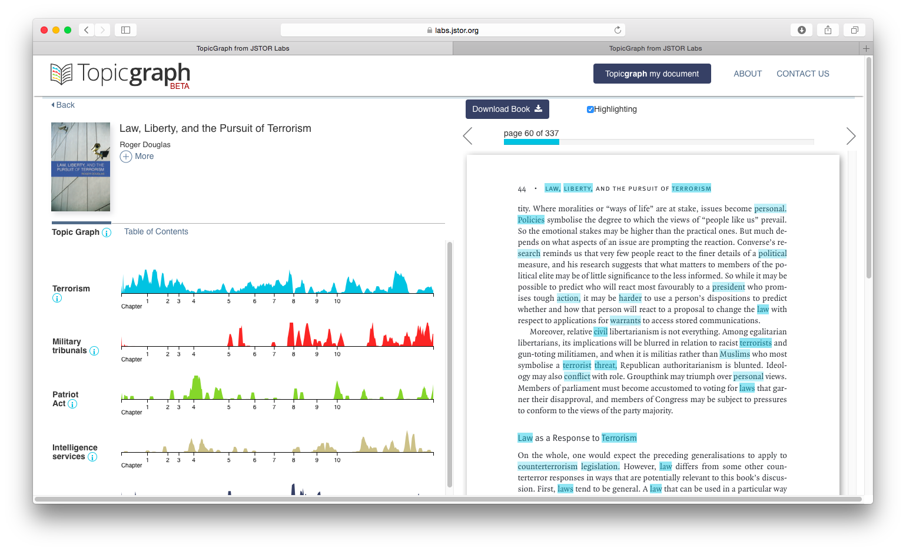
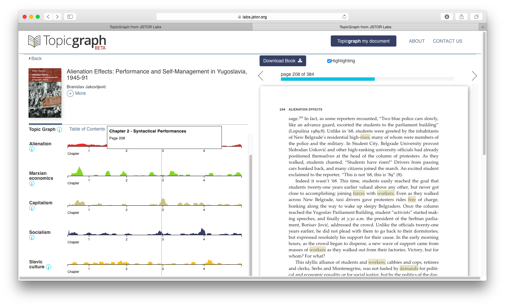
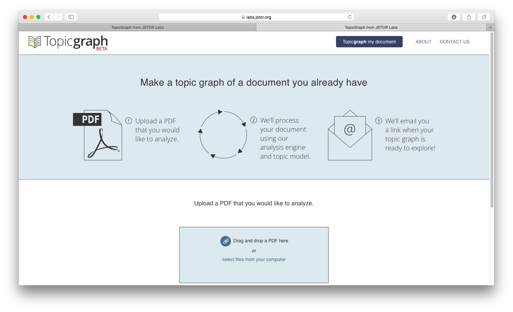

# Digital Humanities Library Lab: Exploring digital collections, 3 March 2017

## Activity: JSTOR Topicgraph
A new tool to help explore scholarly books is [JSTOR Topicgraph](https://labs.jstor.org/topicgraph/){:target="_blank"}. We will look at visualisations of the themes within longform scholarly works and e-books.

JSTOR Labs developed a design thinking process to explore ways to increase the value of longform scholarly argument. This 3:44 video documents the [Reimagining the Monograph](https://labs.jstor.org/monograph/){:target="_blank"} project and introduced the Topicgraph prototype.

We will look at one of the outputs from the project, called Topicgraph. In their words, Topicgraph will allow you to...
> Understand at a glance the topics covered in a book, then jump straight to pages about topics you're researching.

### Using JSTOR Topicgraph
Launch [JSTOR Topicgraph](https://labs.jstor.org/topicgraph/){:target="_blank"}. Choose a title by clicking on its cover. You will see the visualisation load.

A list of topics has been inferred for each book, shown in the left column. 
For each topic, there is a graph with page number on the horizontal axis. The vertical axis represents how strongly that topic is represented on that page. Click in a chart for the relevant highlighted page to appear on the right.

### Exercises
1. Try comparing two topics within the same text. What sorts of things can you use this for?
2. Try comparing this with another text (you will need to open [JSTOR Topicgraph](https://labs.jstor.org/topicgraph/){:target="_blank"} again in another tab/window). What sorts of things can you use this for?
3. Working in pairs, discuss what applications a tool like this may have, and how it could be developed further to be useful to you.
4. _Going further_ Upload a PDF file of a text of your choosing. What themes do you think it will identify, and where?

Chose a text carefully. The visualisation will exist on the web, and the file you upload will be behind it.
The process takes about 10 minutes, and you will get an email when the visualisation is ready.
- Did Topicgraph suggest the themes you predicted? Why might they be different?

[:arrow_up_small: Back to top](#activity-jstor-topicgraph) | [:arrow_double_up: Parent](index.html) | [:arrow_backward: Prev](jischc.html) | [:arrow_forward: Next](ammo.html)

[:house: Home](/)
