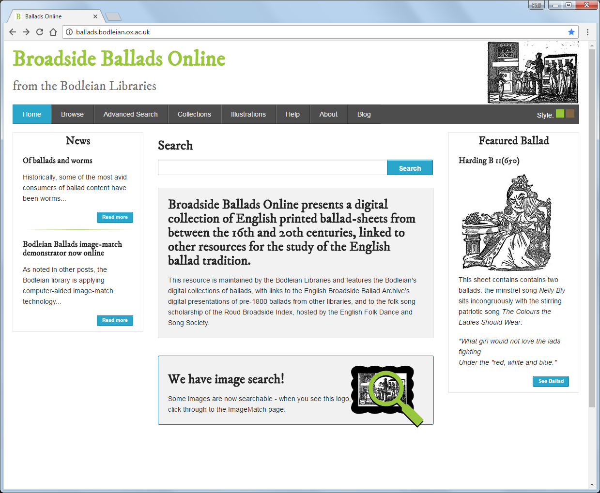
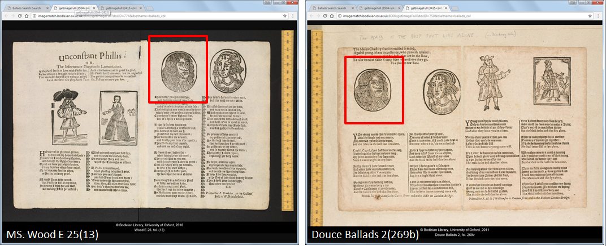
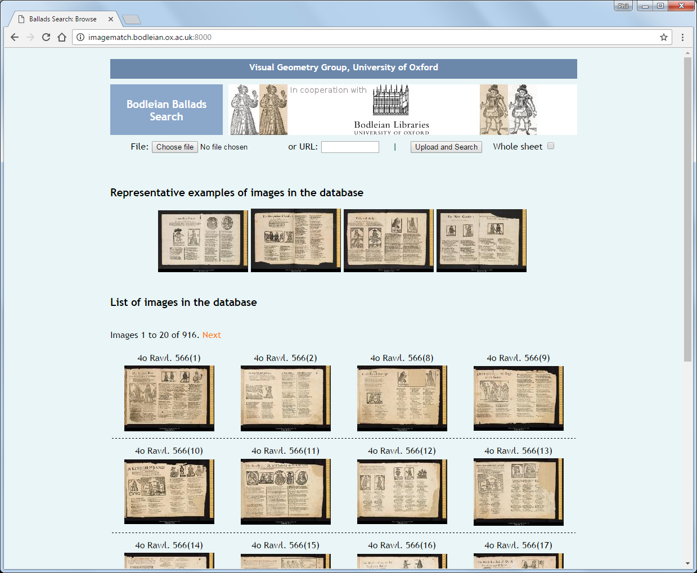
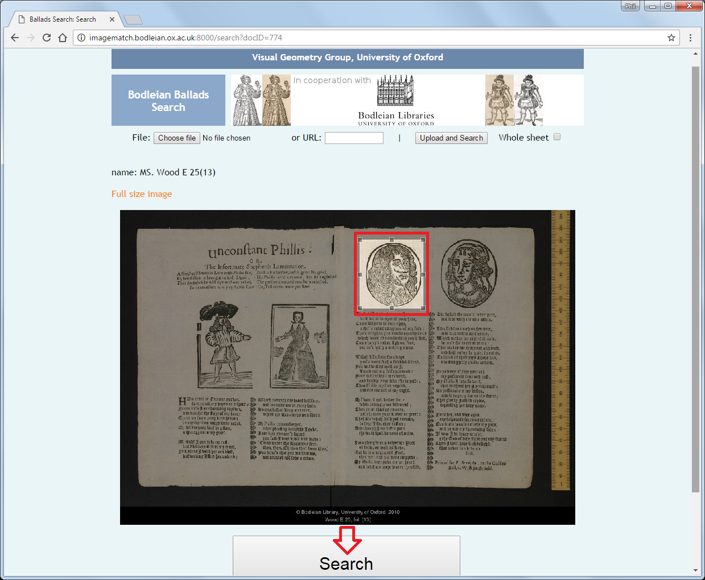
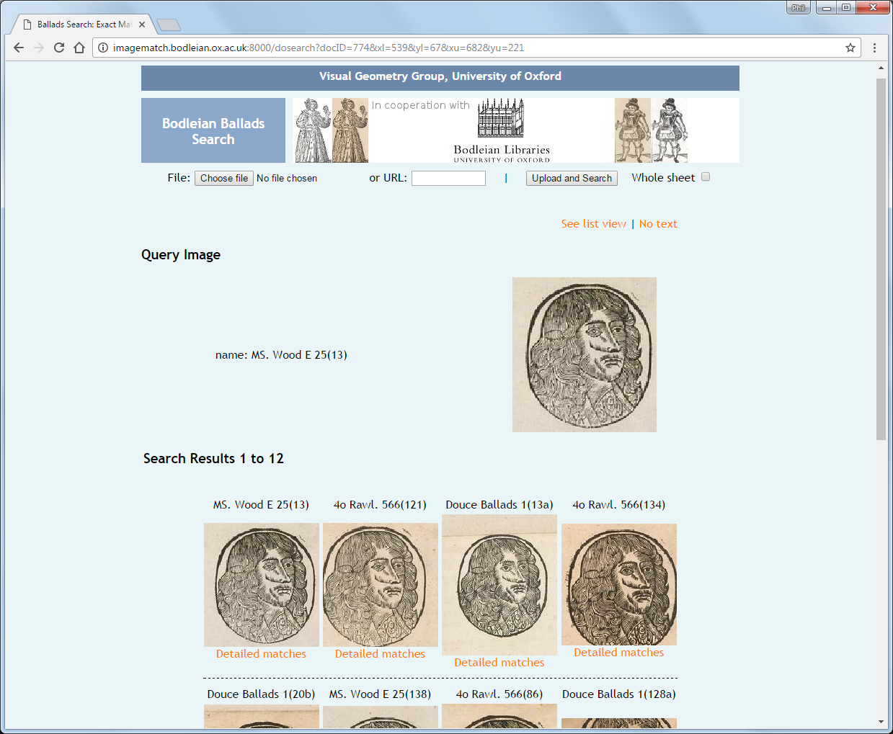

# Digital Humanities Library Lab: Exploring digital collections, 24 May 2017

## Activity: Image searching in a collection of pre-20th century ballads
We will have a look at [Broadside Ballads Online](http://ballads.bodleian.ox.ac.uk/){:target="_blank"} from the Bodleian Libraries. Broadside Ballads Online presents a digital collection of English printed ballad-sheets from between the 16th and 20th centuries, linked to other resources for the study of the English ballad tradition. 

This activity follows on from a research project by Dr Giles Bergel titled '_British Woodcut Printing in Transition_'. The project was conducted in part with the [John Rylands Research Institute](http://www.jrri.manchester.ac.uk/), using ballads and chapbook collections from John Rylands Library, Bodleian Libraries ([Broadside Ballads](http://ballads.bodleian.ox.ac.uk/)), Manchester Central Library, Chetham's Library and others. Some of these books were printed with Thomas Bewick's more refined and robust school of woodcut printing. 

Bergel used software developed at the University of Oxford with these collections to establish whether Bewick's woodblocks we re-used by less illustrious print shops and answer other research questions that depend on knowing which images are similar to one another.

_Objective_: We will use Broadside Ballads Online to observe the values of creating and hosting a new digital image collection, for example by conducting image searches on it.

### Woodcut portrait prints
The scribed text is supported by many illustrations or portraits, printed using woodcut blocks. The specific people depicted can be seen many times throughout the collection, and the same printing block may be used each time.

This collection includes an image search feature. It lets you draw a box around a portrait, and the database will search for any other images which include a similar matching portrait.

This feature can help you to find all occurrences of that person within the collection, analogous to a text search for a known individual's name.

### Tasks
1. Launch the [ImageMatch](http://imagematch.bodleian.ox.ac.uk:8000/){:target="_blank"} page of Broadside Ballads Online. This will give you a list of all searchable images in the database, preceded by four representative examples. 

2. Click on the [first example image, name: MS. Wood E 25(13)](http://imagematch.bodleian.ox.ac.uk:8000/search?docID=774). Use your mouse to drag a box around the third person from the left (a man with long wavy hair in an oval-shaped outset). Click on the Search button.

3. The results page will display your query image and any search results (there should be 12 matches for this person). Clicking on any of the results will take you to the full-page view of that impression. How similar do the matches appear to you? Do the results look like they were printed with the same block?

4. Try this on other figures. Do you get any results? Try matching part of a figure, perhaps just the person's head, and see if there is a difference on results.

### Discussion points

- How successful was this search?
- Would it help if it were easier to [compare two images side-by-side](http://imagematch.bodleian.ox.ac.uk:8000/register?docID1=857&docID2=611&xl=382.00&xu=477.00&yl=255.00&yu=389.00)?
- What collections do you know of that could be enhanced with this kind of tool?
- What other uses could there be for visual searching or identification?
- Do you have any experience of using computer vision with library collections that you might like to share?
- What might the challenges of building a system like this be, and where might you need help?

[:arrow_up_small: Back to top](#activity-image-searching-in-a-collection-of-pre-20th-century-ballads) | [:arrow_double_up: Parent](index.html) | [:arrow_backward: Prev](welcome.html) | [:arrow_forward: Next](jstorta.html)

[:house: Home](/) 