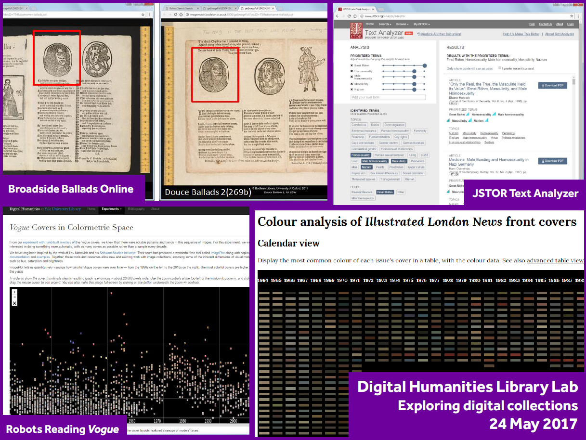

# Digital Humanities Library Lab: Exploring digital collections, 24 May 2017

[Twitter hashtag #dhuml](https://twitter.com/search?f=tweets&q=%23dhuml){:target="_blank"}

This workshop is designed to help Faculty of Humanities researchers develop new and exciting computational projects working with the University Library's digital collections. 
 
[DH@Manchester](http://www.digital-humanities.manchester.ac.uk/) recently sought targeted expressions of interest from Faculty of Humanities researchers at all levels to develop new and innovative computational research projects with partners including [the University of Manchester Library](http://www.library.manchester.ac.uk/) and the [School of Computer Science](http://www.cs.manchester.ac.uk/). Supporting the formal call, the [first Library Lab](../dhll201703/index.html) was offered in March to allow researchers at all levels to gain hands-on experience with tools and techniques in order to go on to develop individual research projects with the collections. Even though that call has closed, this second Library Lab will provide a similar experience using a different selection of collections. This event may be of interest to those who could not attend the first one or would like to do more. 
 
During the afternoon workshop, you will look at digitised historical collections of 20th century newspapers and pre-20th century ballads, using tools to apply colour analysis and image search techniques. You will also use a new tool from JSTOR to search a document for related articles and books. Computers will be available for all participants, but you may prefer to bring your own laptop. 
 
For further information and any queries, please contact Phil Reed: [Phil.Reed@manchester.ac.uk](mailto:Phil.Reed@manchester.ac.uk) or [dh@manchester.ac.uk](mailto:dh@manchester.ac.uk).
 
This event is open to all Faculty of Humanities researchers, but numbers are limited, so please register as soon as possible via the [Eventbrite page](https://www.eventbrite.co.uk/e/digital-humanities-second-library-lab-tickets-33847021352). The event is scheduled for 2pm to 5pm on Wednesday, 24 May 2017 (breaking around 3.30pm for coffee).

## Overview of the workshop
- [Welcome and introduction](welcome.html)
- [Activity: Image searching in a collection of pre-20th century ballads](ballads.html)
- [Activity: Finding references in a text with JSTOR Text Analyzer](jstorta.html)
- [Activity: Colour analysis with front covers of publications](london.html)
- [Wrapping up](wrapping.html)

[:thumbsup: Finished? Please leave some feedback](https://goo.gl/forms/KmYw8TnrlVt0lw5i1)

### Thanks
I would like to thank the lab assistants on the day: Nilani Ganeshwaran and L&eacute;a Anderton. I would like to give special thanks to the researchers and librarians who helped me to shape the workshop and activities: Carol Burrows, Jane Gallagher and Rachel Kirkwood.

[:arrow_up_small: Back to top](#digital-humanities-library-lab-exploring-digital-collections-24-may-2017) | [:house: Home](/) | [:arrow_forward: Start](welcome.html)
