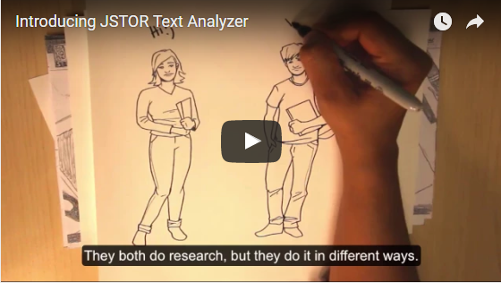
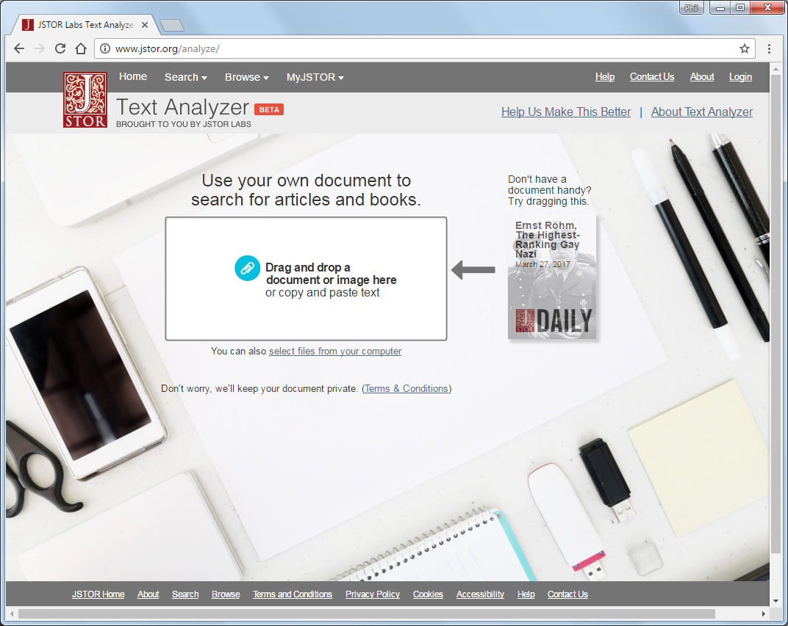

# Digital Humanities Library Lab: Exploring digital collections, 24 May 2017

## Activity: Finding references in a text with JSTOR Text Analyzer
A new tool to search for related articles and books is [JSTOR Text Analyzer](https://www.jstor.org/analyze/){:target="_blank"}. We will use it to search for items that are available in JSTOR.

Text Analyzer is a beta tool build by JSTOR Labs. This 1&frac12;-minute video introduces it.

Quoting from the video...
> Just upload any document. TextAnalyzer will read it, figure out what it's about, and recommend articles and chapters from JSTOR about the same topics. 

You can remove any of the suggested search terms, change the priority of the ones that remain, and add additional terms as appropriate. It has been promoted to students and researchers alike.

### Using JSTOR Text Analyzer

- Launch [JSTOR Text Analyzer](https://www.jstor.org/analyze/){:target="_blank"}

{:target="_blank"}

It is easy to start using, simply drag a document into the big box. They provide an example, "Ernst R&ouml;hm, The Highest-Ranking Gay Nazi", which you can drag from just next to the box. Or you can paste text in from another source, or upload a PDF from your computer.

The left column shows the analysis of the document you provided, that is, the identified topics, people, locations, organisations and more. A selection of these terms is made and shown at the top of the column, which you can refine as instructed.

The right column shows the search results, the suggested relevant items on JSTOR. You may select these to view or download the item.

If you do not have access to your preferred familiar texts, or don't wish to use them, feel free to use texts from other sources such as [OpenBook Publishers](http://www.openbookpublishers.com/){:target="_blank"}.

### Tasks
1. Try the [TextAnalyzer](https://www.jstor.org/analyze/){:target="_blank"} on a text you are familiar with. Are the identified terms what you would expect? If not, why not?
2. Could this tool be useful for you or your students in the ways that JSTOR suggest?
3. What other uses could there be for this tool?
4. If you attended the [previous DH Library Lab](../dhll201703/index.html), how does this tool compare to [JSTOR TopicGraph](../dhll201703/jstortg.html)?

[:arrow_up_small: Back to top](#activity-finding-references-in-a-text-with-jstor-text-analyzer) | [:arrow_double_up: Parent](index.html) | [:arrow_backward: Prev](ballads.html) | [:arrow_forward: Next](london.html)

[:house: Home](/)
