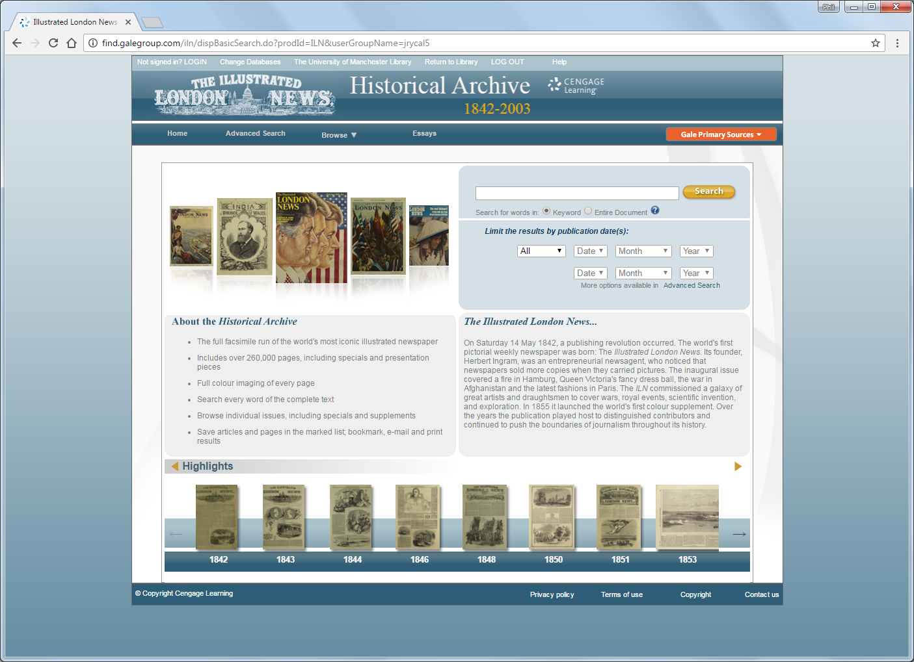
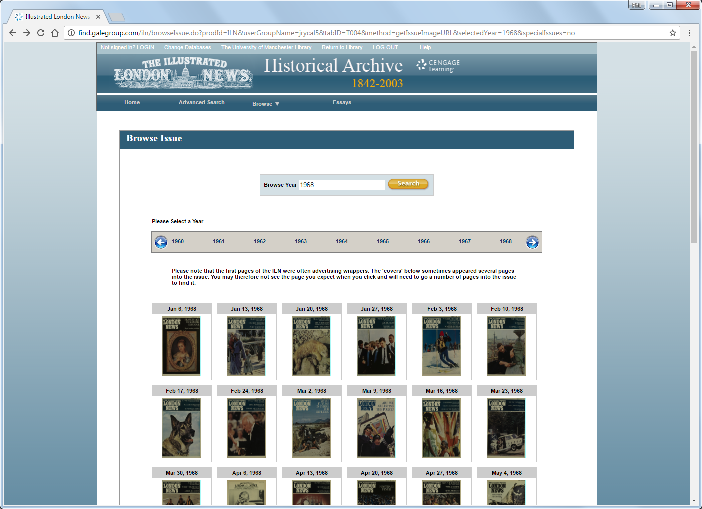
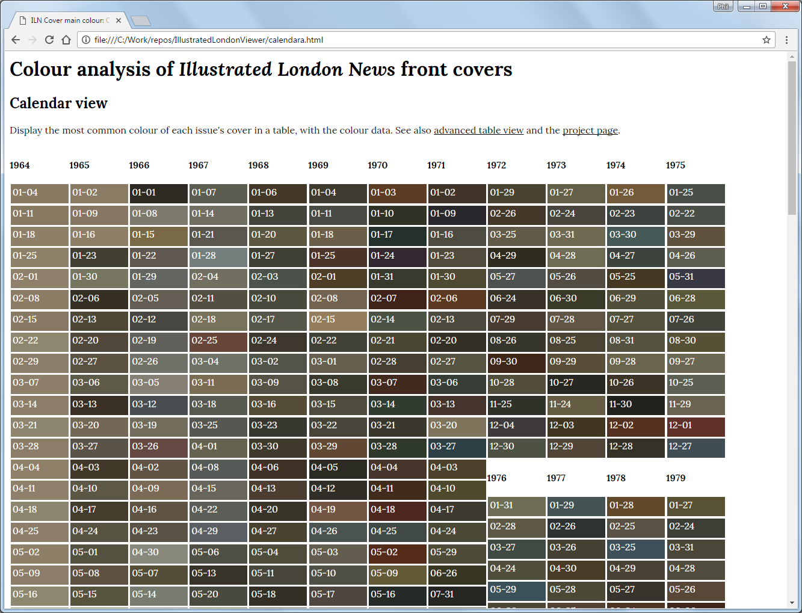
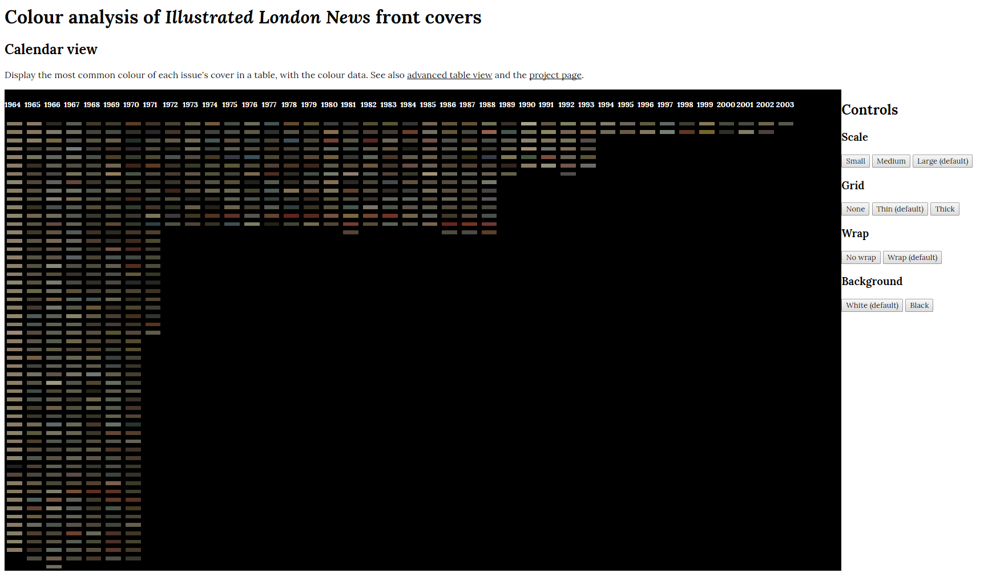
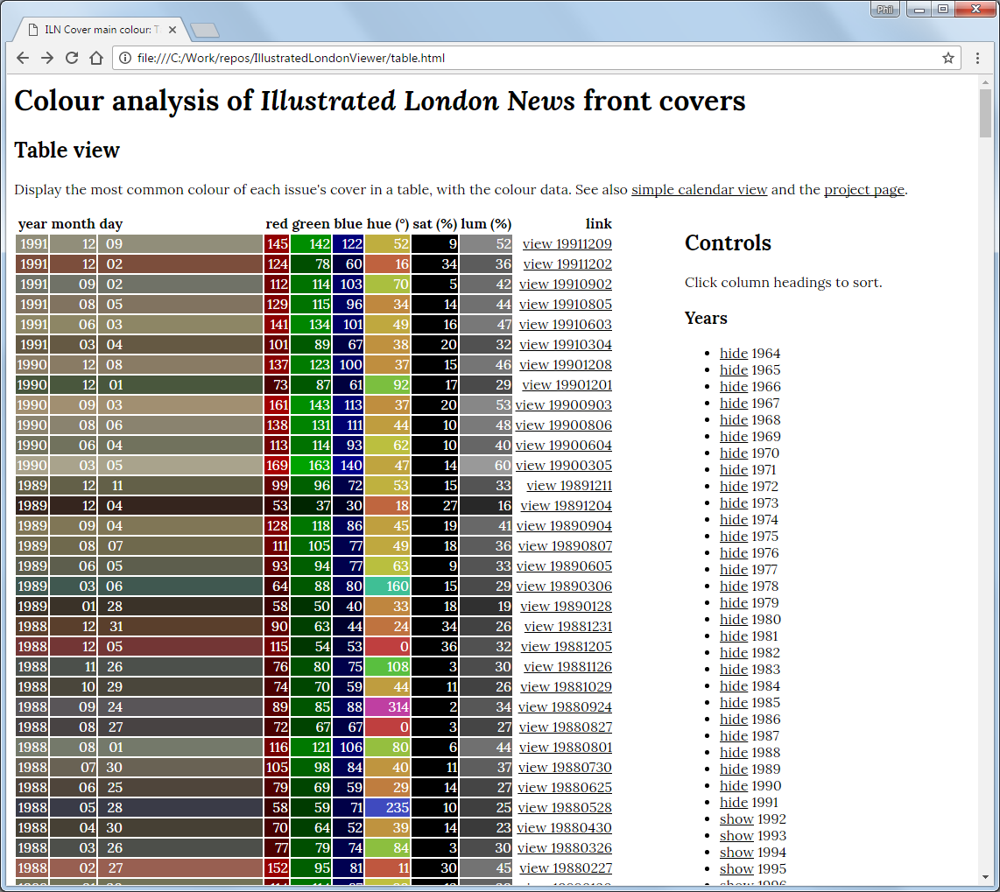
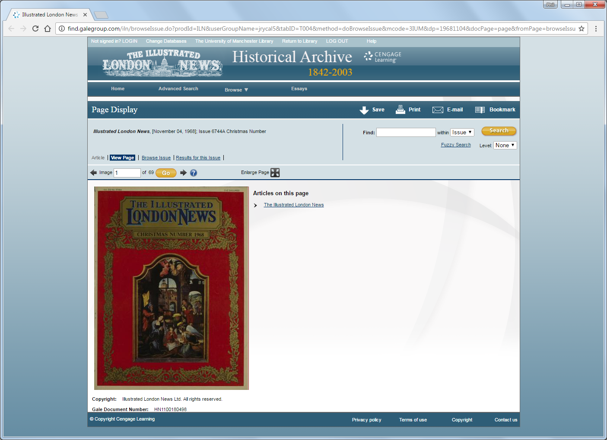
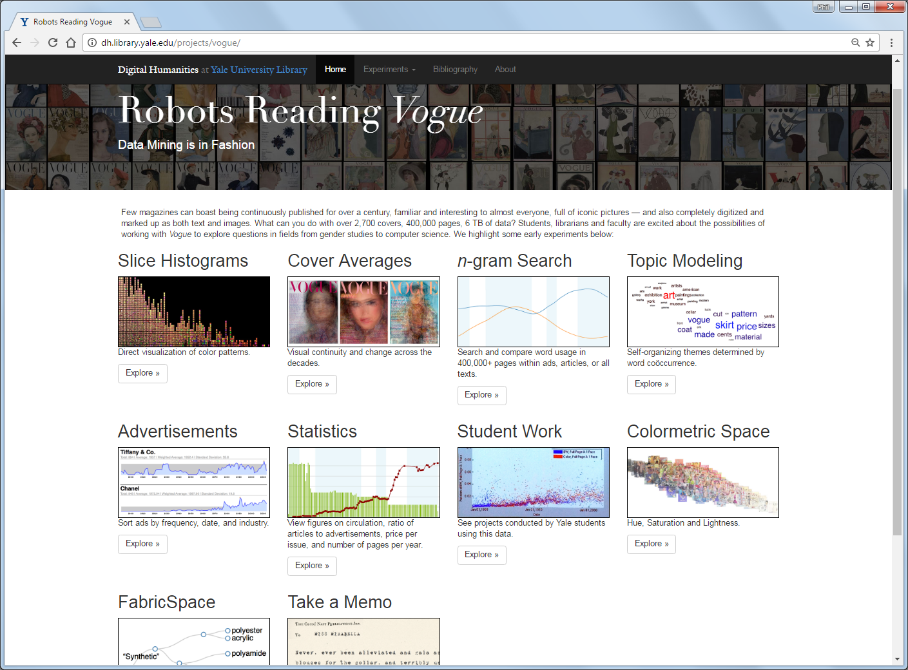
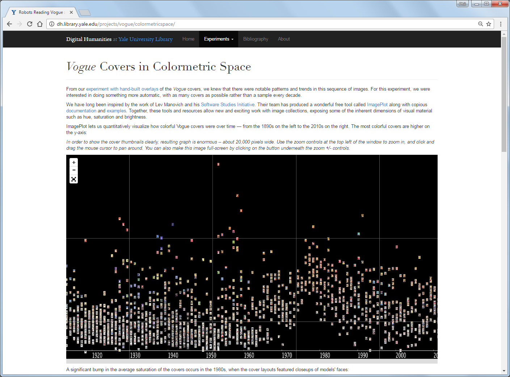

# Digital Humanities Library Lab: Exploring digital collections, 24 May 2017

## Activity: Colour analysis with front covers of publications

_ROUGH_

#### Objectives
Analyse a visual aspect of an entire historical collection using a simple tool and begin thinking of questions to ask. Repeat the process with another collection and a developed set of tools from another institution.

### Overview
_NOTES_
- Gale Cengage collection [Illustrated London News Historical Archive 1842 to 2003](http://www.library.manchester.ac.uk/search-resources/databases/i/dbname-377375-en.htm). 
- Available online through usual browse and search tools.
- This interface suits many uses but does not, for example, allow one to look at the covers of all issues at once.
- We have a hard drive with all issues, as OCR-transcribed text files and image scans.
- We've written a tool to quantify one aspect of the cover image, its (crude) average colour, and another tool to [show you this data](calendara.html).
- Look at the average colours for each issue, what can you see?
  * Are there trends?
  * Is there a correlation between particular colours and particular dates, such as red during times of economic recession, black during times of war...?
- What else would make this more useful? Text from the cover, charts,...
- This is just the start. Look at a series of projects from the Digital Humanities Lab at Yale University Library, [Robots Reading _Vogue_](http://dh.library.yale.edu/projects/vogue/).
  * Look at some of the developed ideas here.
  * How was this possible? Using a ProQuest collection with access to all fulltext and images, using tools.
  * What is the next step?

### A simple(r) example I developed, using _Illustrated London News_  

#### Source code
The following Python code will take a CSV file with headings [year, month, day, red, green, blue] and produce an HTML page to show it. The is a script for calendar view, one for table view, and an example CSV file. Note that the RGB values are integers between 0 and 255.

- [create_calendara_page.py](create_calendara_page.py)
- [create_table_page.py](create_table_page.py)
- [dummy-values.csv](dummy-values.csv)

### A more developed example from Yale University Library, using _Vogue_

### Tasks
_TO DO_

[:arrow_up_small: Back to top](#activity-colour-analysi-with-front-covers-of-publications) | [:arrow_double_up: Parent](index.html) | [:arrow_backward: Prev](jstorta.html) | [:arrow_forward: Next](wrapping.html)

[:house: Home](/)
