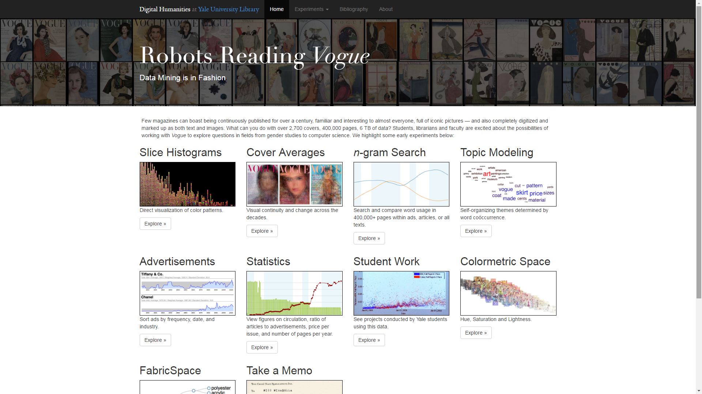
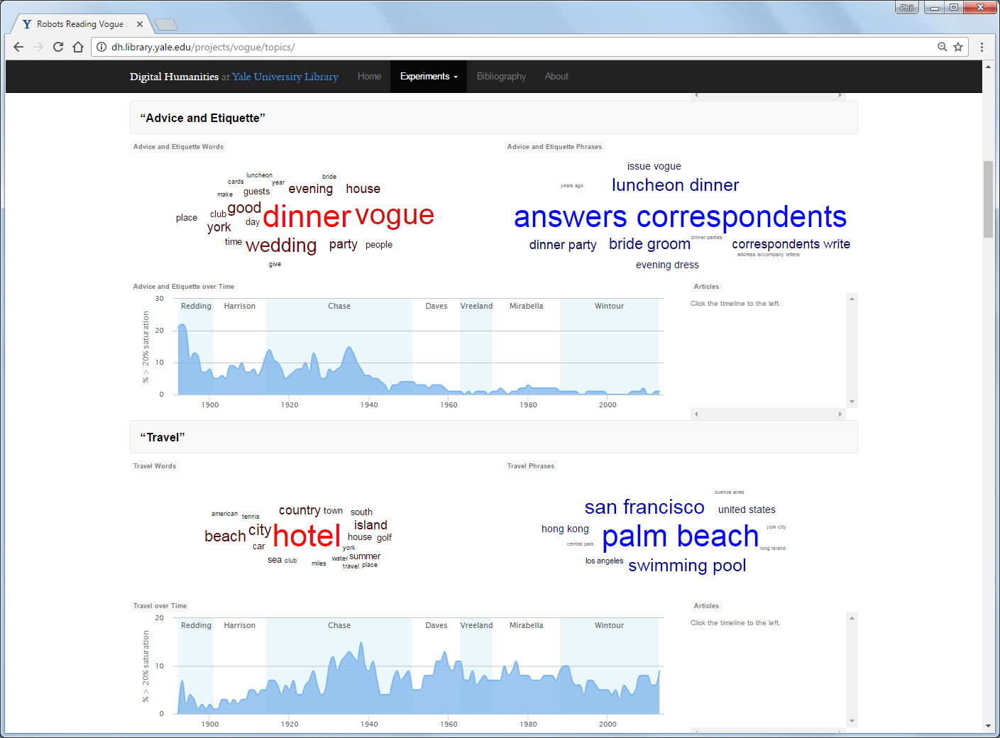
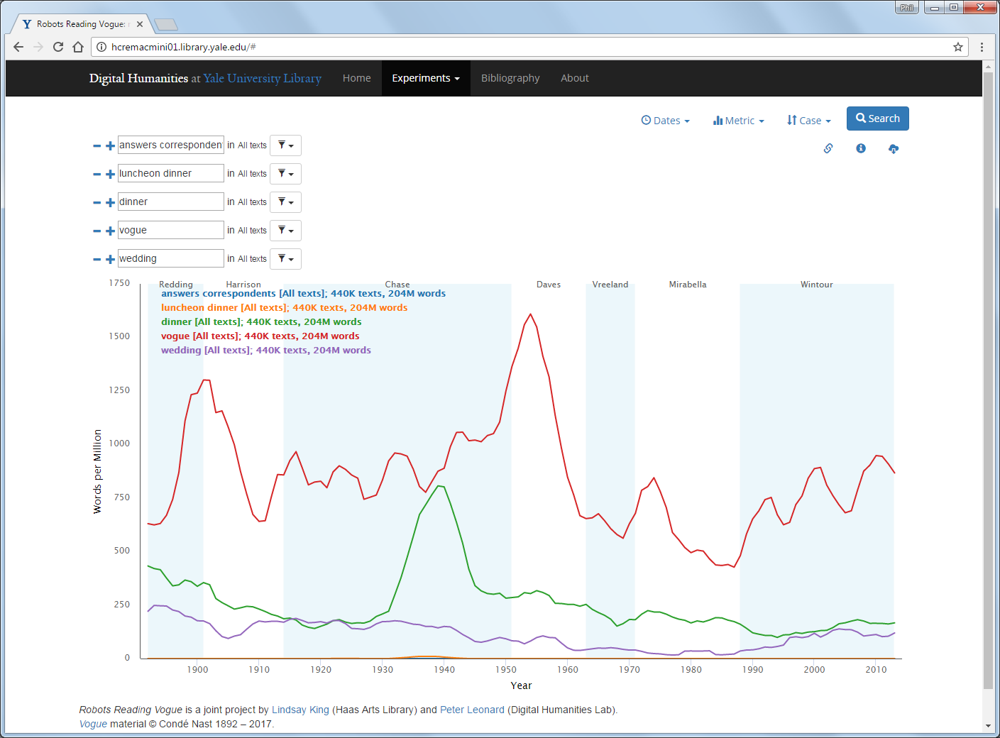
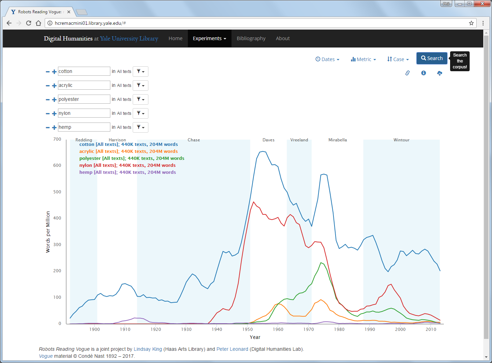

# Digital Humanities Library Lab: Exploring digital collections, 24 May 2017

## Welcome and introduction

### Aims
In this workshop, we will begin to look at how Library collections and resources can be used in Digital Humanities research, and what advantages and challenges may arise. See also the [3 March workshop](../dhll201703/index.html).

### Introductory show case
Before we get into any hands-on examples, I would like to show a more extensive project which uses historical publications, text mining and analysis, image mining and anlysis.

[**Robots Reading _Vogue_**](http://dh.library.yale.edu/projects/vogue/){:target="_blank"}, from the Digital Humanities Lab at Yale University Library.

> "Few magazines can boast being continuously published for over a century, familiar and interesting to almost everyone, full of iconic pictures — and also completely digitized and marked up as both text and images. What can you do with over 2,700 covers, 400,000 pages, 6 TB of data? Students, librarians and faculty are excited about the possibilities of working with Vogue to explore questions in fields from gender studies to computer science."

This project's website includes public access to various tools, including a topic modeller and N-gram viewer.

The topic modeller reads all of the (OCR'd) text and determines what themes might be covered. The charts show the presence of each of these themes changing with time (year of issue) and word clouds of the most important words and phrases involved. See the image above for the identified topic "advice and etiquette".

The words and phrases identified by topic modelling might lead to interesting searches in the N-gram viewer tool. Trying some of these gives the image below.

The use of each word or phrase with time might have a very different pattern to the theme they were identified in, as the words could be used in many different themes. You could use the N-gram viewer to search for any word or short phrase.

We shall return to Robots Reading _Vogue_ in the third activity.

[:arrow_up_small: Back to top](#welcome-and-introduction) | [:arrow_double_up: Parent](index.html) |  [:arrow_forward: Next](ballads.html)

[:house: Home](/)
