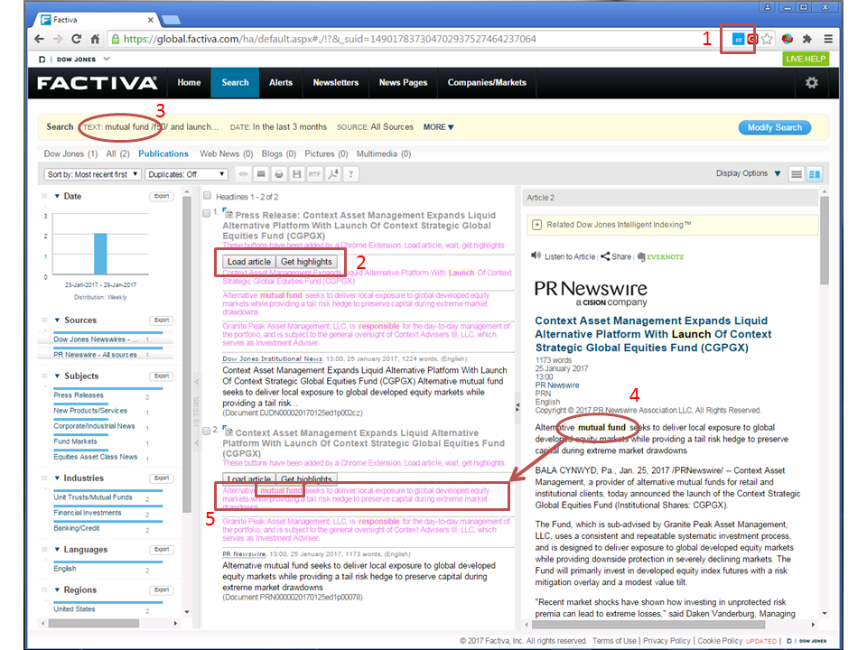

# Digital Humanities Library Lab: Exploring digital collections, 24 May 2017
## Wrapping up
It has been quite a challenge to limit what is covered in a three-hour workshop and allow enough time to cover it properly. I will mention a couple of items that sadly did not make the cut.

### Honourable mention: Factiva Faster Reader

I have developed a tool to the proof-of-concept level which aims to increase reading speed speed when using news search tool [Factiva](http://man-fe.hosted.exlibrisgroup.com/MU_VU1:44MAN_ALMA_DS61213297840001631&tabs=viewOnlineTab).

A search query in Factiva might include keywords that have more than one sense, for example, "sustainable" can mean "ethical" or "long-lasting". You might only be interested in articles that use the keywords in one particular sense, so it would be good to quickly know which had been matched without reading the entire article. 

One way to determine which sense is being used is to look at the words nearby, which can be done by eye or my machine. My tool [FactivaCRX is an extension for Google Chrome](https://github.com/PhilReedData/FactivaCRX) and works as follows.

1. If the extension is enabled and a Factiva search results page is loaded, a new icon appears at the top-right. Click it to run the script.
2. The headlines of the search results are in the middle column. New buttons appear below the titles, with some descriptive violet text. Click to load an article (appears on the right) then click to "get highlights".
3. The search query includes keywords to find in each article.
4. Each time a keyword or phrase appears in the article, it is highlighted (bold text on faint yellow background). 
5. The extension will load each appearance of a keyword and its surrounding paragraph below the buttons and headline in the search results column. The user does not need to move their eyes to the article column unless they have seen that the keyword matched looks interesting.

As previously stated, this tool is just a proof-of-concept for now, but it could be developed to interpret the text surrounding each keyword, or to automatically read more articles (if the Factiva licences allows).

### Other collections

I have built a new [subject guide](http://subjects.library.manchester.ac.uk/digitalhumanities) for using Library collections in Digital Humanities research. It lists some collections, technology and examples of particular interest.

It has been 'soft launched', meaning that relevant database entry pages on the Library website link to it, but it does not appear in the list of all our subject guides.

Do you think it would be useful for you or your students? Do you have any other comments on it? Please [get in touch and let me know](mailto:phil.reed@manchester.ac.uk).

### Copyright and licence agreements
_See the Library's [Copyright Guidance](http://subjects.library.manchester.ac.uk/copyright/) for information and support._

### Conclusions

In this workshop, we have begun to look at how Library collections and resources can be used in Digital Humanities research, and what some of the advantages and challenges of it may include.

### Feedback
[:thumbsup: Do you wish to leave any feedback?](https://goo.gl/forms/KmYw8TnrlVt0lw5i1)

[:arrow_up_small: Back to top](#wrapping-up) | [:arrow_double_up: Parent](index.html) | [:arrow_backward: Prev](london.html)

[:house: Home](/)
